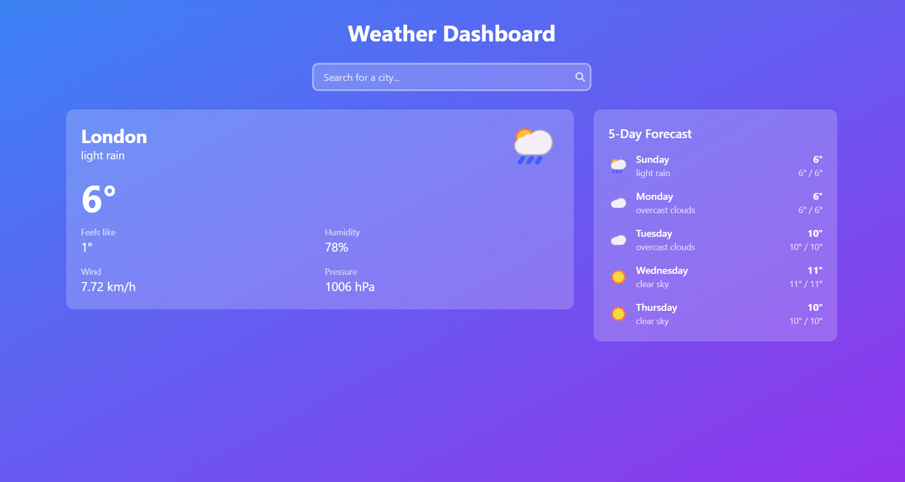
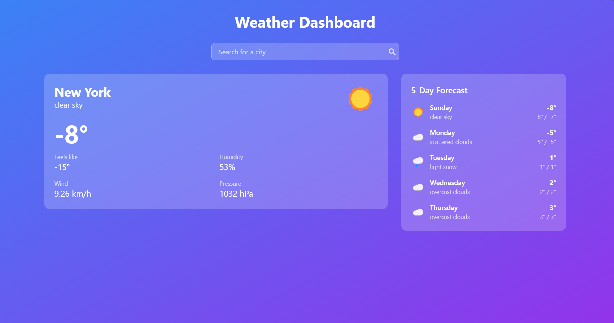
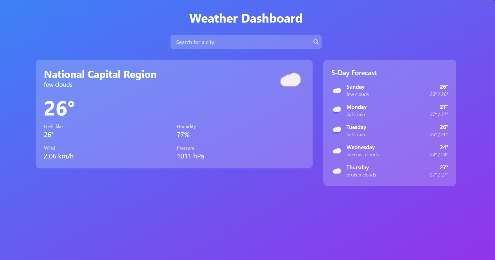

# Weather Dashboard 🌤️

A modern **Weather Dashboard** web app built with **React**, **Tailwind CSS**, and the **OpenWeatherMap API**. It provides current weather, forecasts, and weather-related information in a clean, user-friendly interface.

## Features ✨

- **Modern UI**: Gradient backgrounds and glass-morphism design for a sleek, contemporary look.  
- **Current Weather Display**: Includes:
  - Temperature  
  - Feels like temperature  
  - Humidity  
  - Wind speed  
  - Pressure  
- **5-Day Forecast**: Plan ahead with detailed weather predictions.  
- **Search Functionality**: Find weather information for any city worldwide.  
- **Responsive Design**: Optimized for desktop, tablet, and mobile devices.  
- **Loading & Error States**: Smooth user experience with helpful feedback.  
- **Weather Icons**: Visual representation of weather conditions.  

## Screenshots 📸
### London Example 🌆


### New York Example 🗽


### NCR Example 🏙️


## Technologies Used 🛠️

- **React**: For building dynamic user interfaces.  
- **Tailwind CSS**: For fast and efficient styling.  
- **OpenWeatherMap API**: For reliable weather data.  

## Getting Started 🚀

1. **Clone the repository**:  
   ```bash
   git clone https://github.com/cdrcknt/weather-dashboard.git
   cd weather-dashboard
   ```
2. **Install dependencies**:  
   ```bash
   npm install
   ```
3. **Add OpenWeatherMap API key**:  
   - Create a `.env` file in the project root.  
   - Add your API key:  
     ```env
     REACT_APP_WEATHER_API_KEY=your_api_key_here
     ```
4. **Start the development server**:  
   ```bash
   npm start
   ```
5. **Visit**: Open [http://localhost:3000](http://localhost:3000) in your browser.


## Developers 🤝

- **Cedric Kent Centeno**  
  GitHub: [cdrcknt](https://github.com/cdrcknt)  

## License 📜

This project is licensed under the MIT License. See the [LICENSE](LICENSE) file for details.

## Feedback & Support 💬

Feel free to open an issue or submit a pull request if you have ideas for improvement!  
```
